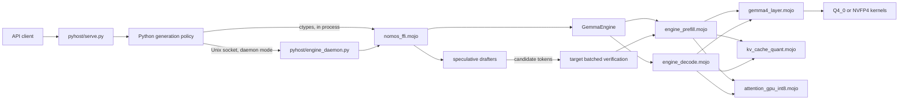
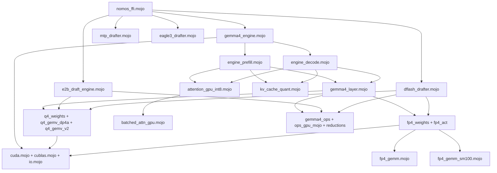

# Nomos Kernel Architecture

## Overview

Nomos is a from-scratch Mojo GPU inference kernel for the 4-bit Gemma-4-31B model on NVIDIA Blackwell GPUs. It implements model loading, transformer execution, quantized matrix operations, attention, KV-cache management, and speculative-decoding support in Mojo. It is not a wrapper around MAX, PyTorch, or another model runtime.

The design has three boundaries:

1. **The Mojo kernel** owns weights, GPU memory, transformer execution, KV state, and draft/verify primitives.
2. **The C ABI** in `nomos_ffi.mojo` exposes opaque engine handles and pointer-based calls from host languages.
3. **The Python host** owns tokenization, sampling policy, grammar constraints, streaming, and the HTTP API.

The performance design goal is to outperform the Q4_0 llama.cpp baseline while retaining a small, inspectable native kernel. This document intentionally makes no benchmark claim.

## Request and execution flow



A normal request is tokenized in Python, then sent through `nomos_prefill` to populate the target KV cache and produce next-token logits. Subsequent tokens use `nomos_decode_step`. The Python host selects tokens and applies request-level policy; the kernel returns post-softcap FP32 logits.

Speculative decoding changes the cadence, not the target model's authority. A smaller or blockwise drafter proposes several candidate tokens. The target evaluates those candidates together, accepts the matching prefix, rolls back rejected KV rows, and continues from a target-selected correction token. When proposals are accurate, one target verification pass advances multiple tokens and amortizes launch and weight-read overhead. The output remains governed by the target model's acceptance rule.

## Module map

### Model engine

- `lib/gemma4_engine.mojo` defines `GemmaEngine`, the long-lived owner of model weights, CUDA context and library handles, scratch buffers, KV caches, sampling defaults used by the all-in-one ABI, and optional drafter handles. It fixes the Gemma-4-31B geometry used by the kernel: 60 layers, hidden width 5,376, 32 query heads, 16 KV heads, and a 262,144-token vocabulary.
- `lib/gemma4_layer.mojo` contains the per-layer transformer building blocks. It prepares normalized Q/K/V projections, applies attention output projections, and executes the gated MLP and residual path. Its internal dispatch selects the appropriate weight/activation precision kernel for the build and execution phase.
- `lib/gemma4_ops.mojo`, `lib/ops_gpu_mojo.mojo`, and `lib/ops_gpu_mojo_reductions.mojo` provide shared operations such as RMSNorm, QK normalization, RoPE, activation functions, residual updates, embedding loads, and GPU reductions.
- `lib/engine_init.mojo` centralizes initialization helpers, environment-controlled feature selection, and strict precision-path diagnostics.
- `lib/engine_prefill.mojo` runs a sequence batch through all layers. It handles initial prompt prefill, continuation prefill against an existing prefix, and the multirow target pass used for speculative verification.
- `lib/engine_decode.mojo` runs the single-token autoregressive path. It appends KV state, performs attention and projection work layer by layer, and produces logits or an on-device greedy token.

The prefill and decode split is deliberate. Prefill exposes matrix-shaped parallelism over prompt rows, while decode is dominated by the latency and memory traffic of a single new row. Speculative verification reuses the prefill machinery because a group of draft tokens is naturally a small row batch.

### Weight and activation precision paths

Nomos has two 4-bit execution families because “Blackwell” does not expose one uniform instruction set or memory system across all products.

#### Q4_0 with DP4A and MMQ

The unified-memory GB10 path uses Q4_0 weights:

- `lib/q4_weights.mojo` loads the packed weight representation.
- `lib/q4_gemv_dp4a.mojo` quantizes activations to signed 8-bit blocks and evaluates Q4_0 weights with integer dot-product instructions. Its DP4A GEMV variants serve latency-oriented decode and small-row cases.
- The same module contains MMQ tensor-core kernels for small multirow batches, especially speculative verification. These operate on the same block-32 Q4_0 weight law while exploiting the additional row dimension.
- `lib/q4_gemv_v2.mojo` supplies additional occupancy-oriented Q4 kernels used by layer dispatch.

This route fits a unified-memory system well: the packed Q4_0 representation minimizes weight traffic, DP4A handles the narrow decode shape without inflating it into a large matrix tile, and MMQ uses the wider verify shape when speculative decoding creates one.

#### NVFP4 W4A4

Discrete Blackwell targets use native NVFP4 weights and dynamically quantized FP4 activations:

- `lib/fp4_weights.mojo` loads packed E2M1 weights and their block scales.
- `lib/fp4_act.mojo` quantizes FP32 activation rows into NVFP4, including per-token global scaling and per-16-value block scales.
- `lib/fp4_gemm.mojo` implements the warp-level block-scaled MMA route available on the relevant workstation/consumer Blackwell targets.
- `lib/fp4_gemm_sm100.mojo` implements the datacenter Blackwell route using the architecture's `tcgen05` block-scaled MMA and its required scale-factor layout.
- `lib/fp4_gemv_v2.mojo` contains narrow-shape variants used by decode dispatch.

The split is architecture-forced. The warp-level `mma.sync` NVFP4 instruction used by the `sm_120a`/`sm_121a` family is not the datacenter `sm_100a` interface. Datacenter Blackwell instead requires `tcgen05`, different M tiling, and scale factors staged in its SF-atom layout. Decode dispatch also accounts for tile economics: padding a single row to a large datacenter MMA tile can cost more than a narrow weight-only route, whereas prefill and verification have enough rows to benefit from W4A4 matrix execution.

These paths should be treated as separate implementations sharing a transformer-level interface, not as interchangeable binaries.

### Quantized KV cache and attention

`lib/kv_cache_quant.mojo` owns the live GPU KV codecs. The product INT4 format is a block-32 symmetric scheme:

- each K or V row is divided into groups of 32 values;
- each group receives an FP16 scale derived from its absolute maximum;
- values are quantized to the symmetric range `[-7, 7]`;
- two signed 4-bit two's-complement values are packed into each byte;
- K and V have independent scales;
- cache rows are indexed by KV head and token position, with window/ring handling where configured.

The packed INT4 cache is the retained representation. Read paths can losslessly sign-extend its nibbles to INT8 and carry the associated scales into integer attention, avoiding a persistent higher-precision copy. Compatibility/debug paths can dequantize a layer to BF16 scratch.

`lib/attention_gpu_int8.mojo` implements the integer attention route. It quantizes queries in 32-lane blocks, computes INT8 Q·K scores with explicit scales, applies softmax in floating point, and performs the probability/value stage. It has kernels for single-row decode, ordered multirow verification, full batched prefill, and prefix-aware continuation prefill. `lib/attention_gpu.mojo` and `lib/batched_attn_gpu.mojo` provide the FP32/BF16 attention paths and shared layout operations.

### Speculative drafter families

- `lib/e2b_draft_engine.mojo` is an independent small Gemma-4 E2B language-model engine. It owns separate weights, scratch space, context, and KV length. The FFI supports standalone loading or pairing it with a target engine, plus prefill, iterative drafting, confidence output, cache rollback, and reset.
- `lib/dflash_drafter.mojo` implements a block drafter. It projects target-side context into a compact five-layer draft tower and produces a block of candidates together, with Q4 and NVFP4 readout routes. It maintains its own context cache and exposes block drafting and rollback operations.
- `lib/mtp_drafter.mojo` and `lib/eagle3_drafter.mojo` provide additional drafter implementations behind the same general proposal/target-verification pattern.
- `lib/spec_decode.mojo`, `lib/spec_draft_e2b.mojo`, and related helpers contain shared contracts and draft-loop utilities.

The drafter is an optimization hint. Target verification, acceptance, and KV-length reconciliation are explicit operations, which keeps speculative state transitions visible at the ABI boundary.

## C ABI and Python integration

`nomos_ffi.mojo` is the shared-library entry module. Exported functions use C-compatible scalars and raw addresses. Long-lived Mojo objects are represented as opaque `Int64` handles; token arrays and logit buffers are caller-owned memory passed by address. Return values are counts or status codes, with negative values reserved for errors.

The primary lifecycle and generation entrypoints are:

- `nomos_version`
- `nomos_init` / `nomos_shutdown`
- `nomos_generate` for an all-in-one prefill-and-decode call
- `nomos_generate_stream` for callback-based token streaming
- `nomos_prefill`, `nomos_decode_step`, and `nomos_decode_step_token`
- `nomos_prefill_cont` for suffix prefill against retained KV state
- `nomos_kv_cache_len`, `nomos_kv_set_len`, and `nomos_reset_kv`

The speculative surface is grouped by drafter:

- `nomos_lm_draft_*` manages the E2B draft engine.
- `nomos_mtp_*` loads, drafts, and verifies with the MTP route.
- `nomos_dflash_*` loads the block drafter, manages its context/cache, drafts blocks, and performs fused verification.
- `nomos_eagle3_*` manages the EAGLE-3 route.
- `nomos_verify_fused` is the generic multirow target verification entrypoint.

Additional `nomos_debug_*` and strict-violation exports are diagnostic ABI, not the minimum serving contract.

Python loads the library with `ctypes` in `pyhost/host.py`. `KernelLM` wraps the opaque handle and basic prefill/decode/KV calls. The shared generation mixin keeps sampling, stop-token handling, and other policy outside the kernel.

There are two deployment shapes:

1. **In-process:** the API process constructs `KernelLM` and calls the shared library directly.
2. **Daemon:** `pyhost/engine_daemon.py` is the sole GPU-owning process and keeps the loaded engine alive. `pyhost/kernel_client.py` sends framed prefill, step, continuation, cache-length, and health operations over a Unix-domain socket. `pyhost/serve.py` can then restart independently without reloading weights or reallocating the engine.

`pyhost/serve.py` supplies the HTTP/chat surface, tokenizer, streaming response format, and request policy. It is deliberately separated from the native inference engine.

## Build model: one GPU architecture per shared library

Mojo specializes and bakes GPU code for one target architecture into each `libnomos_kernel.so`. Architecture checks and compile-time GPU intrinsics in the precision modules are resolved for that target. A library built for one compute capability must therefore never be copied to or deployed on a different architecture, even when both devices are Blackwell.

Build each target on an environment configured for its exact accelerator:

```text
source checkout + target-specific Mojo/CUDA environment
                    |
                    v
             refresh_build.sh
                    |
                    v
        libnomos_kernel.so for ONE sm target
                    |
                    v
      deploy only with the matching GPU architecture
```

`refresh_build.sh` is the canonical local recipe. It:

1. synchronizes the Pixi environment;
2. compiles the small C shims as position-independent objects;
3. invokes `mojo build --emit shared-lib` on `nomos_ffi.mojo`;
4. links the CUDA runtime, cuBLAS, the math library, and the shims;
5. checks the resulting dynamic dependencies and exported `nomos_*` symbols.

The checked-in recipe identifies its current target in the build banner. For another supported architecture, use the corresponding target-configured build environment and produce a separately named or separately packaged artifact. Do not use one architecture's `.so` as a cache for another.

## Dependency map



## Onboarding guide

For a first source pass:

1. Read `nomos_ffi.mojo` to understand the public lifecycle and buffer contracts.
2. Read `lib/gemma4_engine.mojo`, then follow one request through `engine_prefill.mojo` and `engine_decode.mojo`.
3. Read `lib/gemma4_layer.mojo` to see precision dispatch at each projection.
4. Choose the precision family for the target GPU: Q4_0 (`q4_gemv_dp4a.mojo`) or NVFP4 (`fp4_act.mojo`, `fp4_gemm.mojo`, and `fp4_gemm_sm100.mojo`).
5. Trace KV append/read through `kv_cache_quant.mojo` into `attention_gpu_int8.mojo`.
6. Read one drafter end to end, then follow its candidates into `nomos_verify_fused` and the target's batched prefill path.
7. Build a fresh shared library for the exact target architecture before running parity or serving tests.

